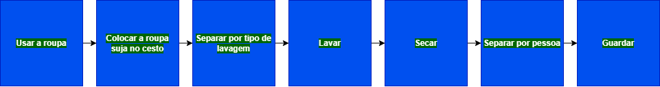
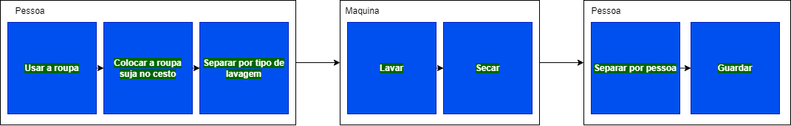
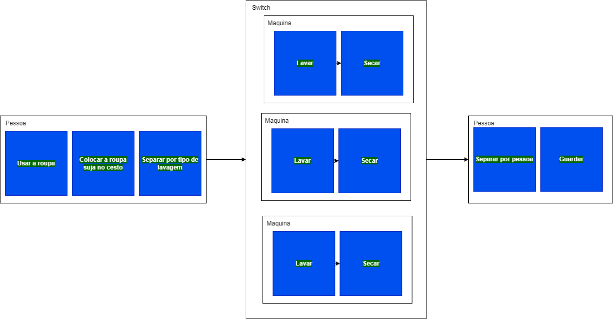

## Sobre o objetivo 
Esse projeto é um projeto intermediário para a construção de um sistema de computação distribuída em Ruby. Porém, diferente de modelos de computação como Apache Airflow e Spark, seu foco é em IaaS, e em gerenciamento de concorrência, não paralelismo.

## Inspiração para o projeto
Trabalhar com Big Data em Ruby envolve o uso de vários scripts pequenos e independentes que manipulam bases de dados, mas esses scripts não são controlados. Quando se fala em DataOps, é necessário se preocupar com a infraestrutura, escalabilidade da aplicação para lidar com cargas de trabalho maiores, estabilidade e confiabilidade do sistema. DataOps envolve a manutenção de uma cultura DevOps para gerenciar e orquestrar dados de maneira simples. No entanto, trabalhar com DataOps ainda é algo relativamente novo e não existe uma biblioteca de orquestração específica para Ruby. A ideia é criar uma aplicação em Ruby que seja facilmente escalável. Eu não planejo continuar o projeto depois de concluído, a menos que haja viabilidade de mercado e eu tenha ajuda, pois é complexo criar algo desse tipo e gerenciar rotinas e prioridades. Meu foco é treinar a construção de algoritmos de concorrência, aplicações de escala "infinita" e orquestração, como gerenciamento de instâncias.


## Resumo do projeto
Como o foco do projeto é inspirado em se trabalhar com um modelo IaaS, todo elemento básico de funcionamento são grafos, que armazenam algum pedaço de código ou um conjunto desses, que pode ser gerenciado por sua própria task (um processo ou thread separado por ex.), algo bem semelhante ao funcionamento de Atores (em concorrência). A ideia é permitir a construção de pipelines onde a construção de concorrência é gerenciada pela própria lib. Usando essa lib, você tem uma programação mais declarativa, em vez de imperativa, dizendo como os grafos/pipelines serão construidos, e qual será o fluxo do dado.

## Exemplo simples de aplicação
Considere um pipeline que tem por foco realizar o cálculo de equação do segundo grau, cada grafo tem a capacidade


A estrutura em código no pipeline acima seguirá da seguinte forma
```ruby
Graph.new(
    UsaRoupa.new(),
    ColocaRoupaCesto.new(),
    SeparaRoupaLavagem.new(),
    Lavar.new(),
    Sescar.new(),
    Separar.new(),
    Guardar.new()
)
```
Cada classe acima é um grafo por definição.

Considere agora que queremos separar as responsabilidades de cada grafo. Supondo que queremos acelerar a eficiência do pipeline utilizando, podemos separar em grafos menores, onde cada um é controlado por um sistema separado, permitindo o uso básico de concorrência. Uma nova estrutura pode ser montada da seguinte forma

```ruby
Graph.new(
    Person.new(
        UsaRoupa.new(),
        ColocaRoupaCesto.new(),
        SeparaRoupaLavagem.new(),
    ),
    Machine.new(
        Lavar.new(),
        Secar.new(),    
    ),
    AnotherPerson.new(
        Separar.new(),
        Guardar.new()
    )
)
```

Supondo ainda que uma única maquina de lavar não seja suficiente. A Ideia é que facilmente isso possa ser escalado 

```ruby
Graph.new(
    Person.new(
        UsaRoupa.new(),
        ColocaRoupaCesto.new(),
        SeparaRoupaLavagem.new(),
    ),
    Switcher.new(
        Machine.new(
            Lavar.new(),
            Secar.new(),    
        ),
        Machine.new(
            Lavar.new(),
            Secar.new(),    
        ),
        Machine.new(
            Lavar.new(),
            Secar.new(),    
        ),
    ),
    AnotherPerson.new(
        Separar.new(),
        Guardar.new()
    )
)
```

## O que falta fazer
- [ ] permitir com que cada grafo seja executado de forma assíncrona, fazendo com que cada grafo tenha sua própria fila interna.
- [ ] Permitir uma comunicação indireta entre o grafo anterior e posterior, No caso de um 'switcher' por exemplo, não há controle quando um grafo está sobrecarregado ou não. A ideia é que este grafo seja capaz de liberar um grafo interno caso este esteja sobrecarregado, o grafo interno ao switcher deve se capaz de avisar o próprio switcher que está sobrecarregado.
- [ ] Criar Grafos Remotos utilizando o protocolo nativo de comunicação do ruby (drb).
- [ ] Cria grafos com capacidade de acumular resultado para tratamento de dados em lotes.
- [ ] Observar comportamentos caso algum grafo não funcione corretamente (tolerância à falha)
- Fim do projeto (expetativa é que seja finalizada até final de janeiro).